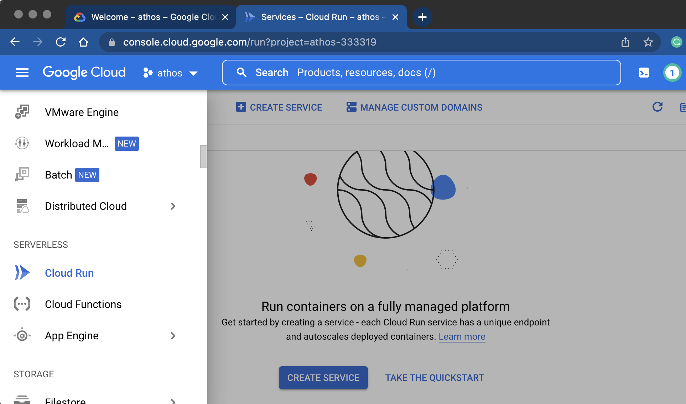
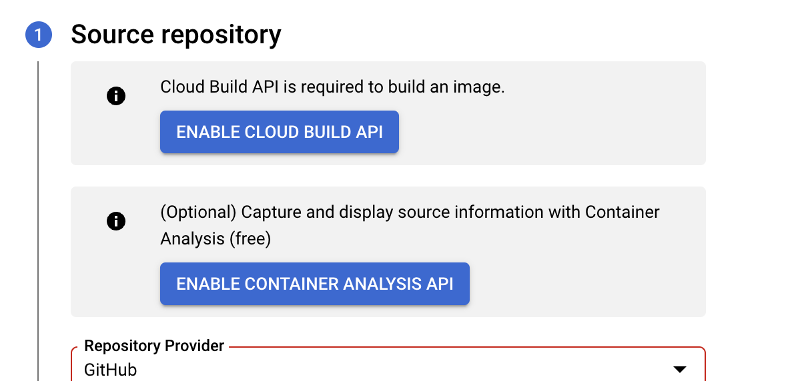
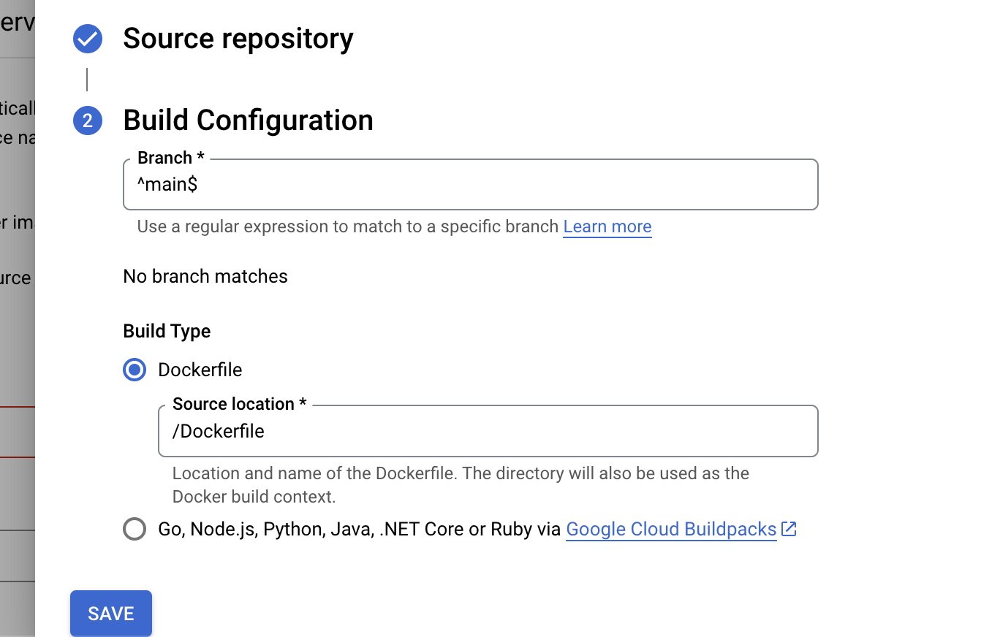
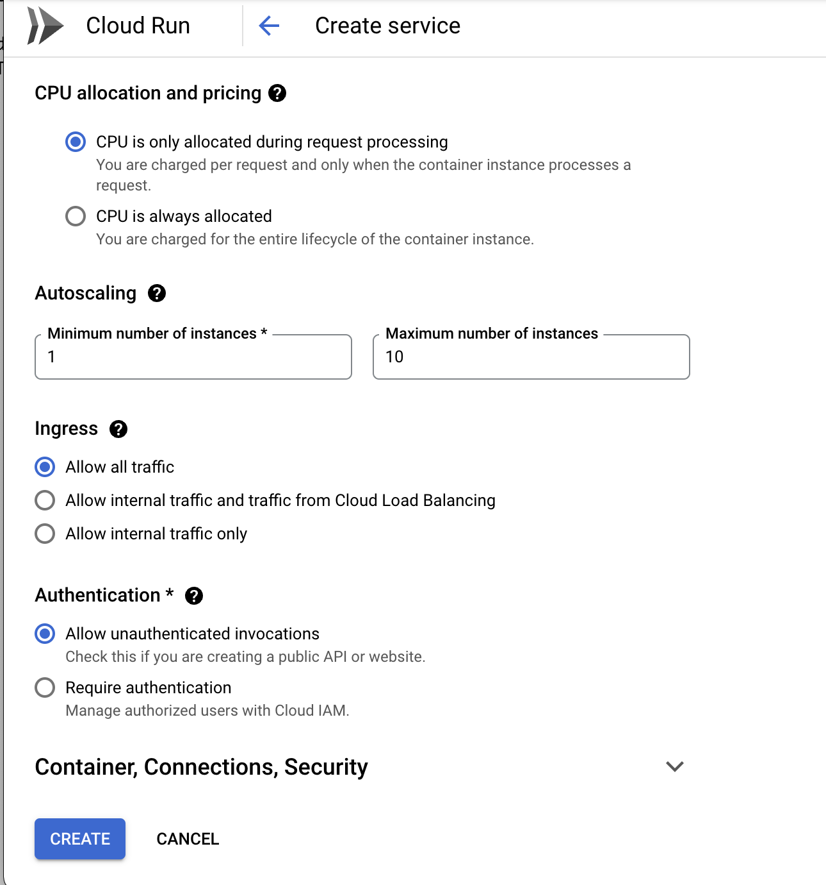

```{r, include=FALSE, warning=FALSE, message=FALSE}
options(htmltools.dir.version = FALSE)
knitr::opts_chunk$set(comment = "#>", echo=TRUE, fig.align='center')
```


# Assuntos

- Consumindo APIs no R (pacote `{httr}`)

- O pacote `{plumber}`

- O que é docker

- Como empacotar um plumber

- Como automatizar um deploy

---
# Está tudo preparado?

- [Conta Google Cloud Platform](https://console.cloud.google.com/)

- [Conta GitHub](https://github.com/)

- R e RStudio

```{r, eval=FALSE}
install.packages("usethis")
install.packages("httr")
install.packages("plumber")
install.packages("shiny")
install.packages("AzureStor")
```

---
class: inverse, center, middle
# Introdução

---
# Exemplos de implantação que vamos praticar

### Disponibilizar uma API

Permitir que um usuário faça uma chamada para o software e receba a resposta desejada via HTTP.
  
  - **Implantação**: servir a API em uma máquina remota.

### Transformar um dashboard em um site dinâmico:

Um endereço fixo que, quando acessado, exibe o dashboard.
  
  - **Implantação**: servir o dashboard em uma máquina remota


---
# Exemplo de API

- Um exemplo de API **sem autenticação** é a PokéAPI: https://pokeapi.co/docs/v2

```{r, echo=FALSE, fig.align='center'}
knitr::include_graphics("static/pokeapi.png")
```


---
# PokéAPI

- Este **endpoint** recebe o nome de um Pokémon e retorna uma lista de dados

```{r}
library(httr)

resposta <- GET("https://pokeapi.co/api/v2/pokemon/ditto")
resposta

content(resposta)$moves[[1]]$move$name
```

---
# Exemplo de API com autenticação

```{r, echo=TRUE}
# Sys.setenv(NASA_KEY = "89fcjds0asdj03m3xmzj974")
NASA_KEY <- Sys.getenv("NASA_KEY")
```

- exemplos de APIs **com autenticação** são as da NASA: https://api.nasa.gov/

- APIs podem receber parâmetros que alteram o seu comportamento (p.e. chave)

```{r, echo=FALSE, fig.align='center', dpi=150, fig.height=10}
knitr::include_graphics("static/nasaapi.png")
```

---
# APOD API

- Este **endpoint** retorna a "foto astronômica do dia" para uma certa data

```{r}
params <- list(
  date = "2019-12-31",
  api_key = NASA_KEY # Guardada no meu computador
)

resp <- GET("https://api.nasa.gov/planetary/apod", query = params)
content(resp)$url
```


---
background-image: url(https://apod.nasa.gov/apod/image/1912/M33-HaLRGB-RayLiao1024.jpg)
background-size: cover

---
# O pacote {plumber}

> Um pacote R que converte o seu código R pré-existente em uma API web usando
uma coleção de comentários especiais de uma linha

- Qualquer função que recebe uma entrada bem definida e retorna uma saída
estruturada pode se tornar uma API

- Exemplo: [https://decryptr.netlify.app/](https://decryptr.netlify.app/)
  
---
# Exemplo de {plumber}

- Para criar uma **API local** com o `{plumber}`, basta comentar informações
sobre o endpoint usando `#*`

```{r, eval=FALSE}
library(plumber)

#* Escreve uma mensagem
#* @param msg A mensagem para escrever
#* @get /echo
function(msg = "") {
  paste0("A mensagem é: '", msg, "'")
}
```

- A função precisa estar salva em um arquivo para que possamos invocar os poderes
do `{plumber}` no mesmo

---
# Invocando a API

- Para implantar a API **localmente**, basta rodar os dois comandos a seguir

```{r, eval=FALSE}
library(plumber)
api <- plumb("arqs/exemplo_api.R")
api$run(port = 8000)
```

- A função `run()` inicializa a API em http://localhost:8000 (dependendo da
**porta** escolhida)

```{r, eval=FALSE}
params <- list(msg = "Funciona!")
resp <- GET("http://localhost:8000/echo", query = params)

content(resp)[[1]]
```

`#> [1] "A mensagem é: 'Funciona!'"`

---
# Swagger

- Swagger é essencialmente uma API que ajuda a criar APIs, incluindo uma
interface com **documentação** em http://localhost:8000/__docs__/

```{r, echo=FALSE, fig.align='center', dpi=130}
knitr::include_graphics("static/swagger.png")
```

---
# Exemplo de POST

- Um **endpoint** POST normalmente recebe dados, esse é um exemplo simples

```{r, eval=FALSE}
#* Retorna a soma de dois números
#* @param a O primeiro número
#* @param b O segundo número
#* @post /sum
function(a, b) {
  as.numeric(a) + as.numeric(b)
}
```

```{r, eval=FALSE}
params <- list(a = 2, b = 4)
resp <- POST("http://localhost:8000/sum", body = params, encode = "json")

content(resp)[[1]]
```

`#> [1] 6`

---
class: inverse, center, middle
# Docker

---
# O que é Docker?

> Docker é uma _platform as a service_ (PaaS) que usa virtualização de sistemas
operacionais para implantar softwares em "contêineres"

- O Docker não passa de um programa que roda no seu computador e permite
criar e usar **contêineres**

- Contêineres são máquinas virtuais (mais sobre isso a seguir) "superficiais",
acessíveis somente pela linha de comando

- Contêineres são **isolados** entre si e empacotam seu próprio **software**,
bibliotecas e configuração

- Contêineres são construídos em cima de **imagens**, modelos que descrevem os
componentes da máquina virtual

- Para testar, acesse https://labs.play-with-docker.com/

---
# O que é uma máquina virtual?

> Máquina virtual (VM) é um software que provém a funcionalidade de um
computador físico, mas apenas através de emulação

- Normalmente uma máquina virtual emula um **sistema operacional** completo,
desde um monitor até entradas USB

- Um hipervisor usa software nativo para simular **hardware virtual**,
permitindo que código seja executado sem saber que está em uma VM

- Com uma VM é possível "criar" um computador Ubuntu dentro de um Windows e
vice-versa, por exemplo

- Diferentemente de um contêiner, VMs são pesadas e "profundas", dependendo de
uma imagem (ISO) para instalar o sistema operacional

---
# Docker vs. VM

- Note as vantagens e desvantagens de cada arquitetura

```{r, echo=FALSE, fig.align='center', dpi=130}
knitr::include_graphics("static/dockervm.png")
```

---
# Docker

Comandos básicos:

```{}
docker run hello-world
docker images
docker ps -a
docker images
docker rm
docker rmi
docker stop
```


.footnote[
 caso não tenham Docker instalado dá para praticar no [Play With Docker](https://labs.play-with-docker.com/)
]

---
# Dockerfile

- Passo-a-passo de configuração/instalação de coisas. Ele especifica um **container**.

- Tem operadores próprio: FROM, RUN, COPY, CMD, WORKDIR, ENV, EXPOSE etc.

```{r, eval=FALSE}
FROM rocker/r-ver:4.0.5

RUN apt update -y

COPY . /meuApp

CMD ["Rscript", "2+2"]
```

---
# Exemplo de Dockerfile

- A base já foi feita pelo autor do `{plumber}` e tem tudo que precisamos

- Copiamos o arquivo para **dentro do contêiner** de modo a utilizá-lo

- **Expor a porta** 8000 é necessário porque ela é onde a API será servida

- O **comando** de execução deve ser o caminho para o arquivo fonte da API (isso
está descrito na documentação)

```{}
FROM trestletech/plumber

COPY exemplo_api.R /

EXPOSE 8000/tcp
CMD ["/exemplo_api.R"]
```

---
# Docker Hub

- "Github" das imagens de Docker. É um serviço de **"Registro de Containeres"**.

- Grande parte das imagens Docker já estão disponíveis no **Docker Hub** (como
um CRAN do Docker)

  - Inclusive, lá estão várias imagens específicas para R, incluíndo RStudio
  Server, Shiny, etc. https://hub.docker.com/u/rocker

- Podemos criar uma imagem nova com um **Dockerfile**, um arquivo que especifica
como ela deve ser construída

  - O primeiro componente é sempre a **imagem base** (muitas vezes um sistema
  operacional)
  
  - A seguir vêm os comandos de **configuração**
  
  - Por fim, o **comando** a ser executado pelo contêiner


---
# Exemplo de imagem e contêiner

- Para criar a imagem, é necessário estar dentro do diretório do Dockerfile

- O comando `docker build` monta uma imagem a partir do Dockerfile e seus
arquivos associados e dá um nome para a mesma (argumento `-t`)

- O comando `docker run` executa uma imagem, criando um contêiner

  - O argumento `-p` indica a porta a ser servida no hospedeiro e a porta
  original
  
  - O argumento `--rm` limpa o armazenamento depois que tudo acaba

```{}
cd arqs/exemplo_api/

docker build -t exemplo .

docker run -p 8000:8000 --rm exemplo
```

---
# Implantação contínua

> Em engenharia de software, CI/CD refere-se genericamente à combinação das
práticas de integração contínua (CI) e implantação contínua (CD)

- Dado um certo código e um método consistente de implantá-lo, faz todo sentido
**automatizar** o processo

- Implantação contínua normalmente envolve transferir a versão mais
recente/**estável** do software e colocá-la em produção

  - O CD de um serviço encapsulado em Docker necessita automatizar o **build**

  - Existe uma série de serviços que detectam uma nova versão de um
  **repositório** e automaticamente criam atualizam a sua imagem

- Hoje vamos falar sobre o **Github Actions** porque ele se conecta em
outros serviços que vamos usar

---
class: inverse, center, middle
# Deploy

---
# Exemplo de CD no GCP Cloud Run

Menu Lateral > **Cloud Run** > **CRIAR SERVIÇO**

```{r, echo=FALSE, fig.align='center', out.width="70%"}

```

---
# Exemplo de CD no GCP Cloud Run

Configurar a primeira revisão do serviço:
  - Escolha a segunda opção: **Implantar continuamente novas revisões de um repositório de origem**
  - **SET UP WITH CLOUD BUILD**

```{r, echo=FALSE, fig.align='center', out.width="90%"}
knitr::include_graphics("static/gc02.png")
```


---
# Exemplo de CD no GCP Cloud Run

Configurar um repositório de origem:
  - Primeiro clique em **ENABLE CLOUD BUILD API**
  - Escolha "Github" e dê permissões (botão Authenticate)
  - Encontre o seu repositório que tem o seu plumber e o seu Dockerfile dentro.
  - clique em **NEXT**

```{r, echo=FALSE, fig.align='center', out.width="80%"}

```
  
---
# Exemplo de CD no GCP Cloud Run

Configurar um repositório de origem:
  - Escolha a branch principal (geralmente é `main` ou `master`)
  - Build Type: **Dockerfile** (e deixe Source location como `/Dockerfile` mesmo)
  - clique em **SAVE** e **SAVE**


```{r, echo=FALSE, fig.align='center', out.width="80%"}

```
  

---
# Exemplo de CD no GCP Cloud Run

.pull-left[
Configurar como este serviço é acionado:

- **CPU allocation and pricing:** CPU is only allocated during request processing
- **Autoscaling:** Mínimo de 1 e máximo de 10
- **Ingress:** Permitir todo o tráfego
- **Authentication:** Permitir invocações não autenticadas
- clique em **CREATE**
]
 
.pull-right[
```{r, echo=FALSE, fig.align='center', out.width="80%"}

```
] 

---
# Testando um deploy

> DevOps (desenvolvimento + operações de TI) tem por objetivo acelerar o ciclo
de desenvolvimento e prover CD com software de alta qualidade

- Depois que o deploy estiver pronto (máquina virtual rodando, configurações
realizadas) é essencial testar

- Em um ambiente corporativo em que os riscos são altos, os testes precisam
ocorrer **antes** do deploy

- Muitas vezes é vital ter um **ambiente de testes** bem configurado que simule
todos os problemas pelo qual o programa pode passar

  - Estamos usando a metodologia **XGH**, então testamos só depois de implantar

- Alguns testes: corretude, carga, responsividade, etc.

---
# Testando a API

```{r, eval=FALSE}
params <- list(a = 1, b = 5)
resp <- GET("http://<link.do.app>/somar_dois_numeros", query = params)

content(resp)[[1]]
```

```{r, echo=FALSE}
"6"
```


- Ainda seria possível associar um domínio a esses IPs, mas isso (configuração
de CDN) foge do tópico da aula.

---
class: inverse, center, middle
# Fim. Próximo capítulo é shiny.
