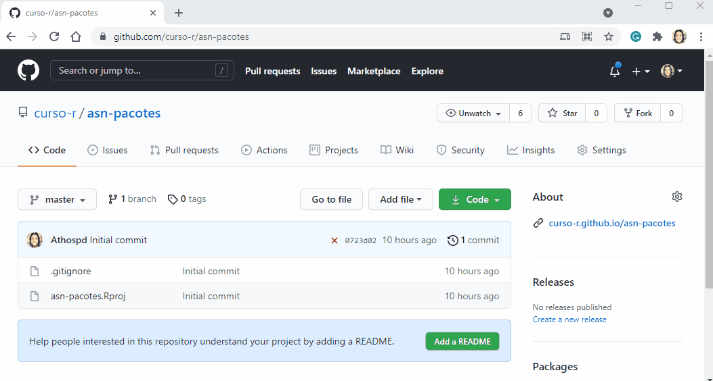

```{r setup, include=FALSE}
`%>%` <- magrittr::`%>%`
knitr::opts_chunk$set(eval = TRUE, echo = TRUE, comment = "#>", fig.align = "center")
```

# Sumário

1. Preparando o ambiente de desenvolvimento

1. Projetos + Git e Github

1. Github Pages

1. Github Actions

---
# Referências  e materiais para estudo

- [R Packages](https://r-pkgs.org), livro aprofundado sobre desenvolvimento de pacotes.

- [R for Data Science - capítulo sobre Funcões](https://r4ds.had.co.nz/functions.html)

- [Zen do R](https://curso-r.github.io/zen-do-r/), livro em desenvolvimento pela Curso-R.

- [Materiais da R-Ladies SP sobre a Hacktoberfest 2020](https://r-ladies-sao-paulo.github.io/2020-hacktoberfest/).

- [Folha de dicas do Git em Português](https://training.github.com/downloads/pt_BR/github-git-cheat-sheet/)

---
class: middle, center, inverse
# Preparando o ambiente de desenvolvimento

---
class: middle, center, inverse
# Projetos em R

---
# Projetos em R

```{r, eval=FALSE}
usethis::create_project("meuProjeto")
```

- Uma nova pasta chamada "meuProjeto" será criada.

O arquivo `meupacote.Rproj` faz com que esta pasta seja a pasta padrão (será o `working directory`).

- *Working directory* é a pasta em que o R vai procurar arquivos na hora de ler informações ou gravar arquivos na hora de salvar objetos.

- `getwd()` informa o caminho do seu diretório de trabalho.

Fixar o diretório de trabalho como a pasta raiz do projeto garante que sua análise poderá ser executada por qualquer pessoa e em qualquer computador sem a preocupação de ajustar caminhos até os arquivos utilizados ou criados pelo seu código.


---

# Projetos em R: Exercício

1. Repositório: Criar projeto `usethis::create_project("meuProjeto")`

2. Adicionar Git `usethis::use_git()`

3. Adicionar GitHub `usethis::use_github()`

3. Adicionar README.md `usethis::use_readme_rmd()`

4. Commit: Edite e "commit" as mudanças no código 

5. Push: Suba os commits para o GitHub


---
# Fluxo de trabalho

O diagrama abaixo exemplifica o fluxo de trabalho de um projeto com versionamento.


```{r echo=FALSE, fig.align='center', out.width="70%"}
knitr::include_graphics("img/fluxo_github_rstudio.png")
```

---
# {usethis}

O pacote `{usethis}` ajuda com todo o fluxo de desenvolvimento em R. Ele ajuda a criar arquivos, projetos, usar o Git, criar repositórios no GitHub e muito mais.

Funções frequentes:

```{r, eval=FALSE}
usethis::create_project()
usethis::use_git()
usethis::use_github()
usethis::git_sitrep()
usethis::use_r()
usethis::edit_r_environ()
usethis::use_readme_rmd()
```


---
class: middle, center, inverse
# Git e GitHub

---
# Git

- Git é um **sistema de versionamento**, criado por Linus Torvalds, autor do Linux.

- É capaz de guardar o histórico de alterações de todos os arquivos dentro de uma pasta, que chamamos de repositório.

- Funciona como o "*Track changes*" do word, mas muito melhor.

- Torna-se importante à medida que seu trabalho é __colaborativo__.

- Git é um software que você instala no computador.

- Arquivo `.gitignore`: Lista arquivos que deverão ser ignorados ao versionar o pacote com Git. 

<br>

```{r echo=FALSE, out.width="30%", fig.align='center'}
knitr::include_graphics("img/git.png")
```

---
# GitHub

- GitHub é um site onde você coloca e compartilha repositórios Git.

- Utilizado por milhões de pessoas em projetos de código aberto ou fechado.

- Útil para colaborar com outros programadores em projetos de ciência de dados.

- Existem alternativas, como [GitLab](https://about.gitlab.com/) e [BitBucket](https://bitbucket.org/product).

- GitHub é um site que você acessa na internet.

<br>

```{r echo=FALSE, out.width="40%", fig.align='center'}
knitr::include_graphics("img/github.png")
```

---
# Pacotes e GitHub


.pull-left[


Pacotes do R e repositórios do GitHub são melhores amigos


<br>

O grande cupido dessa amizade é o `{usethis}` <br>

Após deixar o pacote no GitHub, outras pessoas poderão instalá-lo usando a função `remotes::install_github("org/repo")`
]

.pull-right[

```{r echo=FALSE, out.width="90%", fig.align='center'}
knitr::include_graphics("img/hug.gif")
```

]


---
# Fluxo de trabalho

O diagrama abaixo exemplifica o fluxo de trabalho de um projeto com versionamento.


```{r echo=FALSE, fig.align='center', out.width="70%"}
knitr::include_graphics("img/fluxo_github_rstudio.png")
```


---
# Configurando o Git e GitHub no RStudio 


.pull-left[

####  Usando protocolo https

- `r emo::ji("white_large_square")` Ter o pacote `usethis` instalado 

- `r emo::ji("white_large_square")` Se apresentar para o `git` 

- `r emo::ji("white_large_square")` Criar um GitHub Token/PAT

- `r emo::ji("white_large_square")` Armazenar o GitHub Token/PAT 

- `r emo::ji("white_large_square")` Reiniciar o RStudio
]

.pull-right[
#### Usando protocolo ssh

- `r emo::ji("white_large_square")` Todas as etapas para o protocolo https (listadas ao lado)

- `r emo::ji("white_large_square")` Criar as chaves SSH no RStudio

- `r emo::ji("white_large_square")` Adicionar a chave ssh no ssh-agent

- `r emo::ji("white_large_square")` Adicionar as chaves públicas no  GitHub

- `r emo::ji("white_large_square")` Alterar o protocolo padrão no arquivo `.Rprofile`

- `r emo::ji("white_large_square")` Reiniciar o RStudio


Obs: Se você utiliza Linux, recomendamos usar `ssh`.

]

---

# Configure seu usuário do Git

Antes de começarmos a versionar o código do nosso pacote, vamos configurar o Git e o GitHub no RStudio. 

Esse processo precisa ser feito apenas uma vez!

```{r eval=FALSE}
usethis::use_git_config(
  user.name = "SEU NOME NO GITHUB",
  user.email = "seu_email_no@github.com"
)
```

- Em `user.name`, pode ser seu nome mesmo, não precisa ser o nickname.

- O `user.email` precisa ser o que está vinculado à sua conta do GitHub.

---

# Configure o Personal Access Token 

- Ao conectar com o GitHub, você será instruída(o) a criar um *Personal Access Token* (PAT).

- O PAT serve para autenticar ao GitHub, podendo ser utilizado como senha de acesso ou internamente para automatizar tarefas (como criar um repositório).

- Para criar um novo PAT, use a função `usethis::create_github_token()`. Uma janela do navegador será aberta, e você deve autenticar no GitHub (se necessário), criar o novo token, e copiá-lo. 

```{r echo=TRUE, eval=FALSE}
usethis::create_github_token()
```


---

# Armazenar o Personal Access Token 

#### Método 1 - `gitcreds::gitcreds_set()`


.pull-left[
```{r echo=TRUE, eval=FALSE}
gitcreds::gitcreds_set()
# -> Your current credentials for 'https://github.com':
#   protocol: https
#   host    : github.com
#   username: beatrizmilz
#   password: <-- hidden -->
#     
# -> What would you like to do? 
# 1: Keep these credentials
# 2: Replace these credentials
# 3: See the password / token
```
]


.pull-right[
Siga as instruções e cole o PAT quando for solicitado as credenciais.

```{r echo=TRUE, eval=FALSE}
# -> Adding new credentials...
# -> Removing credetials from cache...
# -> Done.
```
]


---

# Armazenar o Personal Access Token 

#### Método 2 - Armazenar manualmente no `.Renviron`

- Use a função `usethis::edit_r_environ()` para abrir o arquivo `.Renviron` para salvar seu token. 

```{r echo=TRUE, eval=FALSE}
usethis::edit_r_environ()
# ● Modify 'C:/Users/beatr/Documents/.Renviron'
# ● Restart R for changes to take effect
```

- Crie uma nova linha na forma `GITHUB_PAT=SEU_TOKEN`, adicione o token, **pule uma linha** e salve o arquivo. Se certifique que o arquivo termina com uma linha vazia!


Use essa estrutura, substituindo os 0 pelo código copiado na etapa anterior:

```{r echo=TRUE, eval=FALSE}
GITHUB_PAT="0000000000000000000000000000000000000000"
```


---

# Checando se a configuração deu certo


- Lembre-se de reiniciar sua sessão do R!
  - **Reinicie o R usando o RStudio**:  CTRL + SHIFT + F10

- Utilize a função `usethis::git_sitrep()` e leia o resultado que aparece no console. A mensagem abaixo foi cortada para mostrar os trechos de interesse!


```{r eval=FALSE}
usethis::git_sitrep()
#> Git config (global)
#> ● Name: 'SEU NOME DEVE APARECER AQUI'
#> ● Email: 'SEU EMAIL DEVE APARECER AQUI'

#> GitHub
#> ● Default GitHub host: 'https://github.com'
#> ● Personal access token for 'https://github.com': '<discovered>' ***IMPORTANTE ESTAR COMO DISCOVERED***
#> ● GitHub user: 'SEU NOME DE USUÁRIO(A) DEVE APARECER AQUI'
#> ● Token scopes: 'gist, repo, user, workflow'
#> ● Email(s): 'SEU EMAIL DEVE APARECER AQUI'
```

---

# Configurando com o SSH (Parte 1)


.pull-left[

- Se você utiliza Linux, recomendamos usar o protocolo `ssh`.

- Além das etapas anteriores (se apresentar para o `git` e configurar o PAT), é necessário seguir os seguintes passos: 

** CRIANDO UMA CHAVE SSH**

- No RStudio, clique em `Tools` -> `Global Options...` -> `Git/SVN`. No campo `SSH RSA Key`, clique em `Create RSA Key`.


Referência: https://happygitwithr.com/ssh-keys.html 

]

.pull-right[

```{r echo=FALSE, fig.align='center', out.width="90%"}
knitr::include_graphics("img/ssh/etapa-1.png")
```

]


---

# Configurando com o SSH (Parte 2)


.pull-left[

** CRIANDO UMA CHAVE SSH**

- Não altere o primeiro campo, mas você pode adicionar uma senha caso queira. Porém você precisará informar essa senha todas as vezes que quiser fazer algumas ações como Pull ou Push. Clique em `Create`.

A sua senha será criada e aparecerá uma caixinha com ela. Pode clicar em `Close`.

Após fechar, veja se o campo `SSA RSA KEY` está preenchido.

Referência: https://happygitwithr.com/ssh-keys.html 

]

.pull-right[


```{r echo=FALSE, fig.align='center', out.width="90%"}
knitr::include_graphics("img/ssh/etapa-2.png")
```

]


---


# Configurando com o SSH (Parte 3)


.pull-left[

**Verificando se o ssh-agent está funcionando**


Referência: https://happygitwithr.com/ssh-keys.html#add-key-to-ssh-agent

]

.pull-right[

- **Mac OS ou Linux** - no terminal, escreva:

```
eval "$(ssh-agent -s)"
```


- **Windows** - no Git Bash shell, escreva:

```
eval $(ssh-agent -s)
```


<br><br><br><br>
A resposta esperada, nessa etapa, é algo como:
```
Agent pid 14198
```


]


---


# Configurando com o SSH (Parte 4)


.pull-left[

**Adicionando a chave ssh no ssh-agent**

- Se você definiu uma senha ao criar a chave ssh, ela será solicitada nessa etapa.


- **Linux** - no terminal, escreva:

```
ssh-add ~/.ssh/id_rsa
```


- **Mac OS** - no terminal, escreva:

```
ssh-add -K ~/.ssh/id_rsa
```


- **Windows** - no Git Bash shell, escreva:

```
ssh-add ~/.ssh/id_rsa
```
<br>

Referência: https://happygitwithr.com/ssh-keys.html#add-key-to-ssh-agent

]

.pull-right[

A resposta esperada, nessa etapa, é algo como:
```
Identity added: /home/bea/.ssh/id_rsa
```

```{r echo=FALSE, fig.align='center', out.width="100%"}
knitr::include_graphics("img/ssh/etapa-5.png")
```

]


---


# Configurando com o SSH (Parte 5)


**Adicionando a chave pública no GitHub**

- No GitHub, vá em `Settings` -> `SSH and GPG keys` -> `New ssh key` (ou clique aqui: https://github.com/settings/ssh/new )  


- No RStudio, clique em `Tools` -> `Global Options...` -> `Git/SVN`. No campo `SSH RSA Key`, clique em `View Public Key`.

- Uma janela vai abrir com a chave pública e você deve copiar o conteúdo todo.

- No campo `Title`, escreva algo que ajude você a lembrar em qual computador essa chave está sendo usada. No campo `Key`, cole todo o conteúdo copiado na etapa anterior. Clique em `Add SSH key`.


<br>

Referência: https://happygitwithr.com/ssh-keys.html#add-key-to-ssh-agent


---


# Configurando com o SSH (Parte 6)


**Dicas**


- Confira se está funcionando executando o seguinte código na aba Terminal, no RStudio: 
```
ssh -T git@github.com
```

- Ao clonar um projeto, é importante utilizar o protocolo que foi configurado. O protocolo padrão utilizado pelo usethis é o `https`. Para alterar para o `ssh` , altere no `.Rprofile` o protocolo padrão a ser utilizado: 

  - Abrir o arquivo o `.Rprofile`: 
  
```
usethis::edit_r_profile()
```

  - Adicione a seguinte linha neste arquivo:
  
```
options(usethis.protocol = "ssh")
```

  - Salve o arquivo e reinicie o RStudio.


<br>

Referência: https://usethis.r-lib.org/reference/git_protocol.html

---

# Versione com o Git e o GitHub

```{r, eval=FALSE}
usethis::use_git()
```

- Rodando o comando acima na pasta do projeto (a nova aba do RStudio que
apareceu) você adiciona controle de versão.

- Você receberá algumas instruções para seguir, mas está tudo certo.

```{r, eval=FALSE}
usethis::use_github()
```

- O comando acima sincroniza a pasta com o GitHub.

- Mais uma vez, você receberá algumas instruções, mas lembre-se  de alterar para o protocolo `ssh` caso tenha feito a configuração usando esse protocolo. Para isso, use o argumento `protocol = ssh`.

---
# Stage & Commit

```{r echo=FALSE, out.width="50%", fig.align='center'}
knitr::include_graphics("img/passo_3_commit_1.gif")
```

- Nesta etapa, você estará descrevendo as modificações que fez nos arquivos selecionados.

- __Observação__: o ato de clicar no item é o passo de Stage.

---

# Push

```{r, echo=FALSE, out.width="50%", fig.align='center'}
knitr::include_graphics("img/passo_4_push.gif")
```

- *Push* (ou *dar push*) significa atualizar o seu repositório remoto (GitHub) com os arquivos que você *commitou* no passo anterior.

---

# Extra: Pull

```{r, echo=FALSE, out.width="50%", fig.align='center'}
knitr::include_graphics("img/passo_5_pull.gif")
```

- *Pull* é a ação inversa do *Push*: você trará a versão mais recente dos arquivos do seu repositório remoto (GitHub) para a sua máquina (caso você tenha subido uma versão de um outro computador ou uma outra pessoa tenha subido uma atualização).

---

# Resumo

1. Repositório: Criar projeto/pacote

2. Adicionar Git

3. Adicionar GitHub

4. Commit: Edite e "Commite" as mudanças no código

5. Push: Suba os commits para o GitHub

6. Pull (extra): Baixe o estado atual do projeto

### Cuidados

- Se uma base de dados tem mais do que 50Mb de tamanho, ela não deveria estar no seu repositório.

- Nem sempre o comando Pull dá certo. Às vezes, você e a colega de trabalho fizeram mudanças no mesmo arquivo e, quando vão juntar, ocorre um conflito.

---
class: middle, center, inverse
name: testes-unitarios

# Comunicação

---

.pull-left[
# O arquivo README.md 

O arquivo `README.md` é importante pois contém informações como: logo (opcional!), introdução (o que ele faz?), instruções de instalação, exemplos de uso, etc.
  
  
A função `usethis::use_readme_rmd()` cria um arquivo `README.Rmd`. Esse arquivo já possui uma estrutura para facilitar o preenchimento das informações. 


O arquivo gerado é um **RMarkdown** (`.Rmd`), e portanto precisamos converter para **Markdown** (`.md`). Para isso podemos usar a função `devtools::build_readme()`.

<!-- Citamos aqui o botão knit? -->
]

.pull-right[
```{r echo=FALSE, out.width="90%"}
knitr::include_graphics("img/readme-chess.png")
```

.footnote[Fonte da imagem: [README do pacote {chess}](https://github.com/curso-r/chess)]

]

---
.pull-left[


# Vignettes

É muito comum a construção de *vignettes* para documentar o pacote. Elas são documentos em HTML melhor formatados do que a tradicional documentação do R.

Você pode usar a função `usethis::use_vignette()` para criar *vignettes*.

<br> 
Atenção: Caso você use alguma distribuição Linux e retornar a seguinte mensagem no `devtools::check()`, você precisa instalar o [qpdf](https://sourceforge.net/projects/qpdf/).


```
> ‘qpdf’ is needed for checks on size
 reduction of PDFs
```

<!-- ### Outros -->

<!-- Se você precisar construir sites, relatórios, dashboards estáticos (flexdashboard) dentro do seu pacote, você pode criar uma pasta chamada `docs/` na raiz do seu projeto para guardar esses arquivos. -->

<!-- Veremos também como criar um site do pacote criado com o `{pkgdown}`. -->

]

.pull-right[
```{r echo=FALSE, out.width="90%"}
knitr::include_graphics("img/vignette-chess.png")
```

.footnote[Fonte da imagem: [Exemplo de vignette do pacote {chess}](https://github.com/curso-r/chess)]

]


---
# Github Pages

- Permite que seus HTMLs sejam mostrados como páginas da web.

```{r echo=FALSE, out.width="80%"}

```


---
# Pacotes/Projetos e GitHub


.pull-left[


Pacotes/Projetos do R e repositórios do GitHub são melhores amigos


<br>

O grande cupido dessa amizade é o `{usethis}` <br>

Bônus: Após deixar o pacote no GitHub, outras pessoas poderão instalá-lo usando a função `remotes::install_github("org/repo")`
]

.pull-right[

```{r echo=FALSE, out.width="90%", fig.align='center'}
knitr::include_graphics("img/hug.gif")
```

]

---
class: middle, center, inverse
name: ci

# Integração contínua

---
# Integração contínua

- Dado um certo código e um método consistente de testá-lo, faz todo sentido
**automatizar** o processo

- Integração contínua normalmente envolve garantir que a versão mais
recente do software está atendendo os padrões de qualidade

- Hoje vamos falar sobre o **GitHub Actions** porque ele se conecta facilmente
com o GitHub

.pull-left[


Alguns exemplos: 

- Vários pacotes usam para fazer executar o check e testes: [{readr}](https://github.com/tidyverse/readr/tree/master/.github/workflows), [{dplyr}](https://github.com/tidyverse/dplyr/tree/master/.github/workflows), [{usethis}](https://github.com/r-lib/usethis/tree/master/.github/workflows), e muitos outros

- Pacote [{mananciais}](https://beatrizmilz.github.io/mananciais/) - atualiza diariamente a base de dados 

- Página [Materiais sobre R](https://materiais-estudo-r.netlify.app/) - atualiza o site sempre que há mudança na base de dados


]

.pull-right[

<br><br>

```{r echo=FALSE}
knitr::include_graphics("https://avatars.githubusercontent.com/u/44036562?s=200&v=4")
```

]

---
# GitHub Actions

> GitHub Actions ajuda a automatizar tarefas dentro de seu ciclo de vida de
desenvolvimento de software https://docs.github.com/pt/actions

- Um **workflow** não passa de um processo bem-definido que será executado no
repositório ao qual ele pertence

- Ele é definido a partir de um arquivo YAML dentro da pasta `.github/workflows`

  - É comum definir workflows para testagem de pacotes, geração de documentação, 
  atualização de dados, etc.
  
- O workflow é, essencialmente, um duende mágico que baixa o nosso repositório
em um **servidor do GitHub** e executa os comandos especificados

  - O plano gratuito já funciona para bastante coisa, mas cuidado com os
  **custos** das máquinas MacOS

---
# Estrutura

- Um workflow tem alguns componentes importantes:

  - **Event**: gatilhos que ativam o workflow, podendo ser desde um push ao
  repositório até uma hora do dia
  
  - **Job**: sequências completas de comandos que podem ser executadas
  paralelamente entre si
  
  - **Step**: uma tarefa dentro de um job, composta por ações
      
      - **Use**: passos importados de outro repositório (úteis para setup)
  
  - **Action**: o átomo do workflow, um comando a ser executado pelo "duende
  mágico"
  
- Também é comum definir **env**, variáveis de ambiente para o workflow

---
# Exemplo de workflow

```yaml
on: [push]                                              # Event
jobs:
  R-CMD-check:                                          # Job
    runs-on: ubuntu-latest
    steps:
      - uses: actions/checkout@v2                       # Use
      - uses: r-lib/actions/setup-r@v1                  # Use
      - name: Install dependencies                      # Step
        run: |                                          # Action
          install.packages(c("remotes", "rcmdcheck"))
          remotes::install_deps(dependencies = TRUE)
        shell: Rscript {0}
      - name: Check                                     # Step
        run: rcmdcheck::rcmdcheck(args = "--no-manual") # Action
        shell: Rscript {0}
```

---
# Integração contínua com GitHub Actions

Para utilizar o GitHub Actions, usamos arquivos `.yaml` que armazenam informações os fluxos de trabalho.

- **Eventos**: Um evento é uma atividade que aciona um fluxo de trabalho. Por exemplo:
  
  - Quando o repositório recebe uma alteração (`on: push`)
  
  - Quando um Pull Request é criado (em outras palavras, alguém está enviando uma contribuição para o repositório) (`on: pull_request`)
  
  - Eventos programados. Ex: a cada hora, todos os dias, uma vez por semana, uma vez por mês, etc. O site [CronTab](https://crontab.guru/) é muito útil para isso.
  
  - Quando acionado "manualmente", ou via API (`on: workflow_dispatch`)
  
- **Trabalho**: Um evento aciona automaticamente o fluxo de trabalho, que contém um trabalho. Em seguida, o trabalho usa etapas para controlar a ordem em que as ações são executadas. Exemplo de ações executadas:
  
  - Executar testes
  
  - Executar um script `.R`

---
# Integração contínua com GitHub Actions (cont.)

- Recomendação: partir de um arquivo de workflow já existente, e alterar o que for necessário. 

  - [Neste repositório](https://github.com/r-lib/actions/tree/master/examples#readme), estão disponíveis alguns exemplos de workflows de GitHub Actions que podemos usar com pacotes em R

- Os arquivos `.yaml` devem estar em um diretório específico do pacote:  `pacote/.github/workflows/nome-do-workflow.yaml`

- O pacote {usethis} também pode nos ajudar nisso. O código a seguir cria o arquivo `.yaml` apresentado no último slide, usado para fazer uma checagem simples no pacote:

```{r eval=FALSE}
usethis::use_github_action("check-release")
```

---
# Exemplo de workflow 

```{r echo=FALSE, out.width="60%"}
knitr::include_graphics("img/action.png")
```

.footnote[[Veja os logs do Exemplo!](https://github.com/beatrizmilz/materiais_estudo_R/runs/2328985236?check_suite_focus=true)]

---
# Referências  e materiais para estudo

- [Zen do R](https://curso-r.github.io/zen-do-r/), livro em desenvolvimento pela Curso-R.

- [R Packages](https://r-pkgs.org), livro aprofundado sobre desenvolvimento de pacotes.

- [R for Data Science - capítulo sobre Funcões](https://r4ds.had.co.nz/functions.html)

- [Materiais da R-Ladies SP sobre a Hacktoberfest 2020](https://r-ladies-sao-paulo.github.io/2020-hacktoberfest/).

- [Folha de dicas do Git em Português](https://training.github.com/downloads/pt_BR/github-git-cheat-sheet/)

---
class: middle, center, inverse

## Fim!
